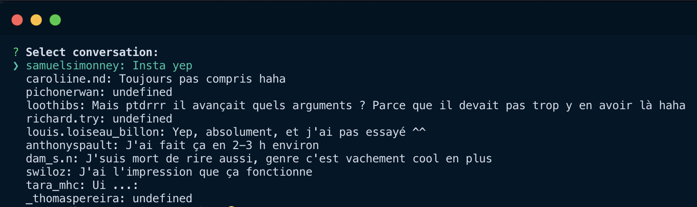
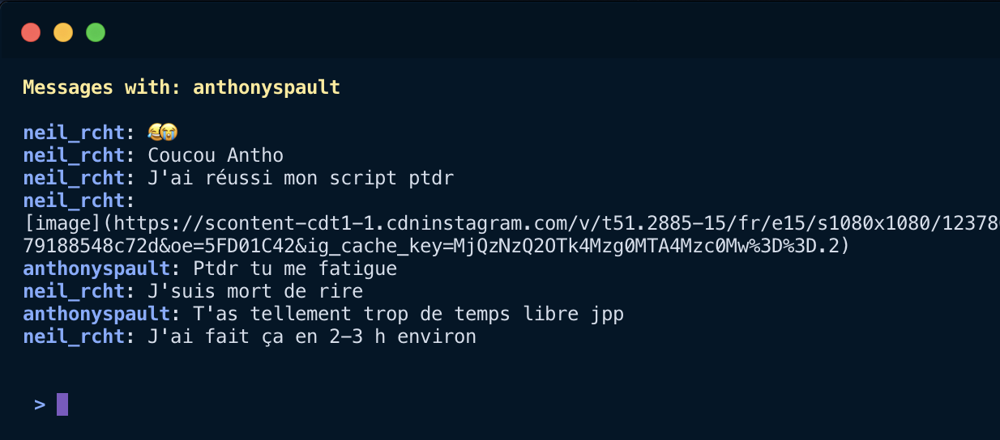

# igdm-cli

Send and receive Instagram direct message through CLI.





## Installation

```sh
$ npm install -g igdm
```

## Usage

Start the app with:
```sh
$ igdm
```

You will be prompted your credentials only for your first connection, on subsequent script starts
it will load your credentials from a session file.

After being logged in, the list of the 20 latest conversations will appear, select a conversation
with arrow keys and select it by pressing <kbd>Enter</kbd> key. Type a message and press <kbd>Enter</kbd> to send it.

## Commands

On the chat screen (conversation listing message), instead of sending messages you can write commands:

`\q`: Stops the process and leaves the app

`\l`: Go back to conversation list

`\r`, (or press <kbd>Enter</kbd> while input is empty): Refresh the current view and fetch latest messages

`\logout`: Logout
